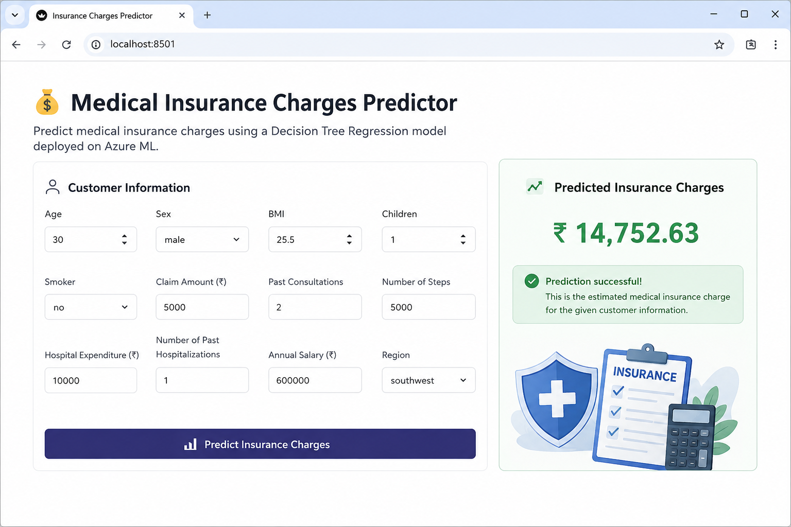

# Medical Insurance Charges Prediction 💰

An end-to-end Machine Learning project that predicts medical insurance charges using **Decision Tree Regression** and provides a **Streamlit web application** with an **Azure ML REST API**.

## 📸 Streamlit App

<p align="center">
  
</p>

## 🛠️ Tech Stack

- Python
- Pandas & NumPy
- Scikit-learn
- Decision Tree Regression
- Azure Machine Learning
- Streamlit
- REST API

## 🔄 Workflow

```text
Dataset → Preprocessing → Decision Tree
       → Model Evaluation → Azure ML Endpoint
       → REST API → Streamlit App
